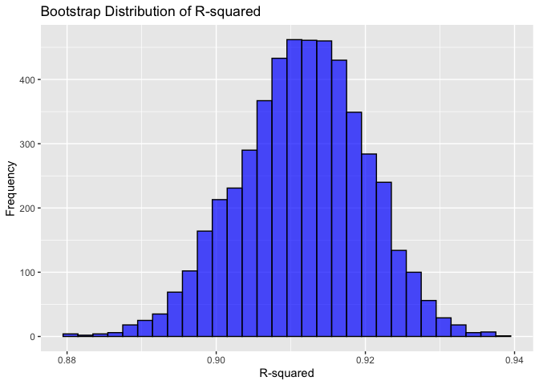
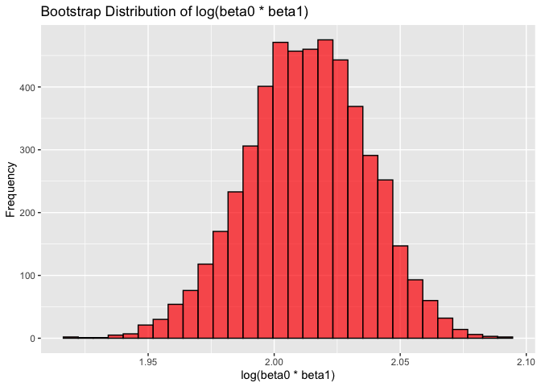
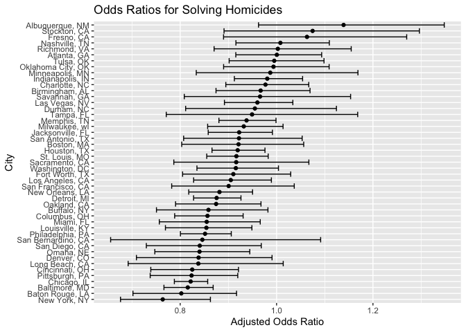
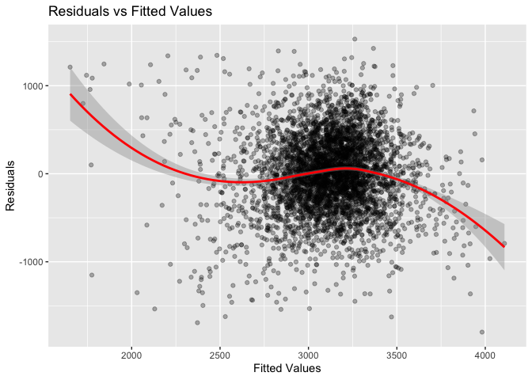
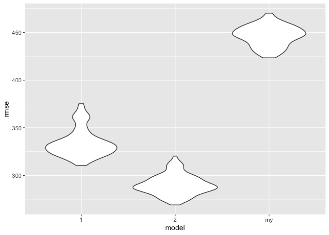

p8105_hw6_SL5454
================
Sining Leng
2024-11-26

## Problem 1

``` r
weather_df = 
  rnoaa::meteo_pull_monitors(
    c("USW00094728"),
    var = c("PRCP", "TMIN", "TMAX"), 
    date_min = "2017-01-01",
    date_max = "2017-12-31") %>%
  mutate(
    name = recode(id, USW00094728 = "CentralPark_NY"),
    tmin = tmin / 10,
    tmax = tmax / 10) %>%
  select(name, id, everything())
```

    ## using cached file: /Users/siningleng/Library/Caches/org.R-project.R/R/rnoaa/noaa_ghcnd/USW00094728.dly

    ## date created (size, mb): 2024-09-26 10:19:10.930058 (8.651)

    ## file min/max dates: 1869-01-01 / 2024-09-30

Bootstrap

``` r
set.seed(123)  
boot_results =
  weather_df |>
  modelr::bootstrap(n = 5000) |>
  mutate(
    model = map(strap, \(df) lm(tmax ~ tmin, data = df)), 
    r_squared = map_dbl(model, ~ broom::glance(.x)$r.squared), 
    log_beta = map_dbl(model, ~ log(coef(.x)[1] * coef(.x)[2])) 
  )
```

Distributions

``` r
# Plot the distribution of R-squared
ggplot(boot_results, aes(x = r_squared)) +
  geom_histogram(bins = 30, color = "black", fill = "blue", alpha = 0.7) +
  labs(title = "Bootstrap Distribution of R-squared", x = "R-squared", y = "Frequency")
```

<!-- -->

``` r
# Plot the distribution of log(beta0 * beta1)
ggplot(boot_results, aes(x = log_beta)) +
  geom_histogram(bins = 30, color = "black", fill = "red", alpha = 0.7) +
  labs(title = "Bootstrap Distribution of log(beta0 * beta1)", x = "log(beta0 * beta1)", y = "Frequency")
```

<!-- -->

The distribution of R-squared appears to be approximately normal. The
values of R-squared range between 0.88 and 0.94, with the highest
frequency occurring aroung 0.91.

The distribution of log beta is also approximately normal. The values of
log beta range from approximately 1.95 to 2.10, and the distribution is
centered around approximately 2.00.

95% confidence intervals

``` r
ci_r = quantile(boot_results$r_squared, c(0.025, 0.975))
ci_log = quantile(boot_results$log_beta, c(0.025, 0.975))

print(ci_r)
```

    ##      2.5%     97.5% 
    ## 0.8945701 0.9271042

``` r
print(ci_log)
```

    ##     2.5%    97.5% 
    ## 1.964166 2.058364

## Problem 2

``` r
us_homicide =
  read_csv("./data/homicide-data.csv", na = c("Unknown"))|>
  janitor::clean_names()|>
  mutate(
    victim_age = as.numeric(victim_age),
    city_state = str_c(city, state, sep = ", "),
    solved = ifelse(disposition == "Closed by arrest", 1, 0)
    )|>
  filter(!city_state %in% c("Dallas, TX", "Phoenix, AZ", "Kansas City, MO", "Tulsa, AL"),
         victim_race %in% c("White", "Black")) 
```

    ## Warning: One or more parsing issues, call `problems()` on your data frame for details,
    ## e.g.:
    ##   dat <- vroom(...)
    ##   problems(dat)

    ## Rows: 52179 Columns: 12
    ## ── Column specification ────────────────────────────────────────────────────────
    ## Delimiter: ","
    ## chr (8): uid, victim_last, victim_first, victim_race, victim_sex, city, stat...
    ## dbl (4): reported_date, victim_age, lat, lon
    ## 
    ## ℹ Use `spec()` to retrieve the full column specification for this data.
    ## ℹ Specify the column types or set `show_col_types = FALSE` to quiet this message.

Logistic regression for Baltimore

``` r
baltimore = 
  us_homicide |>
  filter(city_state == "Baltimore, MD")

baltimore_model = 
  glm(solved ~ victim_age + victim_sex + victim_race, data = baltimore) 

baltimore_model |>
  broom::tidy(conf.int = TRUE, exponentiate = TRUE) |>
  filter(term == "victim_sexMale") |>
  select(term, estimate, conf.low, conf.high)
```

    ## # A tibble: 1 × 4
    ##   term           estimate conf.low conf.high
    ##   <chr>             <dbl>    <dbl>     <dbl>
    ## 1 victim_sexMale    0.816    0.766     0.868

Logistic regression for each city

``` r
city_models =
  us_homicide |>
  group_by(city_state) |>
  nest() |>
  mutate(
    model = map(data, \(x) glm(solved ~ victim_age + victim_sex + victim_race, data = x)),
    results = map(model, broom::tidy, conf.int = TRUE, exponentiate = TRUE)
  ) |>
  unnest(results) |>
  filter(term == "victim_sexMale") |>
  select(city_state, estimate, conf.low, conf.high)

print(city_models)
```

    ## # A tibble: 47 × 4
    ## # Groups:   city_state [47]
    ##    city_state      estimate conf.low conf.high
    ##    <chr>              <dbl>    <dbl>     <dbl>
    ##  1 Albuquerque, NM    1.14     0.963     1.35 
    ##  2 Atlanta, GA        1.00     0.915     1.09 
    ##  3 Baltimore, MD      0.816    0.766     0.868
    ##  4 Baton Rouge, LA    0.802    0.702     0.917
    ##  5 Birmingham, AL     0.967    0.874     1.07 
    ##  6 Boston, MA         0.921    0.803     1.06 
    ##  7 Buffalo, NY        0.859    0.751     0.982
    ##  8 Charlotte, NC      0.977    0.895     1.07 
    ##  9 Chicago, IL        0.822    0.788     0.857
    ## 10 Cincinnati, OH     0.825    0.739     0.921
    ## # ℹ 37 more rows

Plot the estimated ORs and their CIs for each city

``` r
city_models |>
  ggplot(aes(x = estimate, y = reorder(city_state, estimate), xmin = conf.low, xmax = conf.high)) +
  geom_point() +
  geom_errorbar() +
  labs(title = "Odds Ratios for Solving Homicides",
       y = "City", x = "Adjusted Odds Ratio")
```

<!-- -->

Albuquerque, NM has the largest OR for solving homicides. New York, NY
has the lowest OR for solving homicides. The first four cities have ORs
greater than 1, which indicate that male victims are more likely to have
their homicides solved than female victims. Most cities have ORs close
to 1, with the confidence intervals either overlapping 1 or extending to
the right or left. The overall trend suggests that females may have high
homicide resolution in most city.

## Problem 3

``` r
baby_bw =
  read_csv("./data/birthweight.csv", na = c("", "NA", "."))|>
  janitor::clean_names() |>
  mutate(
    babysex = factor(babysex),
    frace = factor(frace),
    mrace = factor(mrace),
    malform = factor(malform),
    .drop = TRUE
  )
```

    ## Rows: 4342 Columns: 20
    ## ── Column specification ────────────────────────────────────────────────────────
    ## Delimiter: ","
    ## dbl (20): babysex, bhead, blength, bwt, delwt, fincome, frace, gaweeks, malf...
    ## 
    ## ℹ Use `spec()` to retrieve the full column specification for this data.
    ## ℹ Specify the column types or set `show_col_types = FALSE` to quiet this message.

Fit a regression model

``` r
bw_model = lm(bwt ~ delwt + smoken + babysex + gaweeks + malform, data = baby_bw)

bw_model |>
  broom::tidy()
```

    ## # A tibble: 6 × 5
    ##   term        estimate std.error statistic   p.value
    ##   <chr>          <dbl>     <dbl>     <dbl>     <dbl>
    ## 1 (Intercept)  -107.      91.5      -1.17  2.42e-  1
    ## 2 delwt           5.61     0.307    18.3   6.06e- 72
    ## 3 smoken         -7.20     0.914    -7.88  4.22e- 15
    ## 4 babysex2      -95.6     13.5      -7.07  1.78e- 12
    ## 5 gaweeks        62.9      2.16     29.1   1.20e-170
    ## 6 malform1       18.6    115.        0.162 8.71e-  1

``` r
baby_bw |>
  add_predictions(bw_model) |>
  add_residuals(bw_model) |>
  ggplot(aes(x = pred, y = resid)) +
  geom_point(alpha = 0.3) +
  geom_smooth(method = "loess", color = "red") +
  labs(title = "Residuals vs Fitted Values", x = "Fitted Values", y = "Residuals")
```

    ## `geom_smooth()` using formula = 'y ~ x'

<!-- -->

I hypothesize that the birthweight is influenced by factors like
mother’s weight at delievery, cigarette consumption, baby’s sex,
gestational age in weeks, and presence of malformations. From the plot,
we can tell that the residuals are randomly scattered around zero with
no discernible pattern. Thus, the model fits well.

Model 1: Using birth length and gestational age

``` r
model1 = lm(bwt ~ blength + gaweeks, data = baby_bw)

model1 |>
   broom::tidy()
```

    ## # A tibble: 3 × 5
    ##   term        estimate std.error statistic  p.value
    ##   <chr>          <dbl>     <dbl>     <dbl>    <dbl>
    ## 1 (Intercept)  -4348.      98.0      -44.4 0       
    ## 2 blength        129.       1.99      64.6 0       
    ## 3 gaweeks         27.0      1.72      15.7 2.36e-54

Model 2: Using head circumference, length, sex, and interactions

``` r
model2 = lm(bwt ~ bhead * blength * babysex, data = baby_bw)

model2 |>
  broom::tidy()
```

    ## # A tibble: 8 × 5
    ##   term                    estimate std.error statistic      p.value
    ##   <chr>                      <dbl>     <dbl>     <dbl>        <dbl>
    ## 1 (Intercept)            -7177.     1265.       -5.67  0.0000000149
    ## 2 bhead                    182.       38.1       4.78  0.00000184  
    ## 3 blength                  102.       26.2       3.90  0.0000992   
    ## 4 babysex2                6375.     1678.        3.80  0.000147    
    ## 5 bhead:blength             -0.554     0.780    -0.710 0.478       
    ## 6 bhead:babysex2          -198.       51.1      -3.88  0.000105    
    ## 7 blength:babysex2        -124.       35.1      -3.52  0.000429    
    ## 8 bhead:blength:babysex2     3.88      1.06      3.67  0.000245

Compare models using cross-validation

``` r
cv_df = 
  crossv_mc(baby_bw, 100) |> 
  mutate(
    train = map(train, as_tibble),
    test = map(test, as_tibble)
  )

cv_result = 
  cv_df |> 
  mutate(
    my_model = map(train, \(x) lm(bwt ~ delwt + smoken + babysex + gaweeks + malform, data = x)),
    model_1= map(train, \(x) lm(bwt ~ blength + gaweeks, data = x)),
    model_2 = map(train, \(x) lm(bwt ~ bhead * blength * babysex, data = x)),
  ) |> 
  mutate(
    rmse_my = map2_dbl(my_model, test, rmse),
    rmse_1 = map2_dbl(model_1, test, rmse),
    rmse_2 = map2_dbl(model_2, test, rmse)
  )

cv_result |> 
  select(starts_with("rmse")) |> 
  pivot_longer(
    everything(),
    names_to = "model", 
    values_to = "rmse",
    names_prefix = "rmse_"
  ) |> 
  ggplot(aes(x = model, y = rmse)) + 
  geom_violin()
```

<!-- -->

The second model using head circumference, length, sex, and all
interactions has the lowest median RMSE, which indicates that it
performs well.
